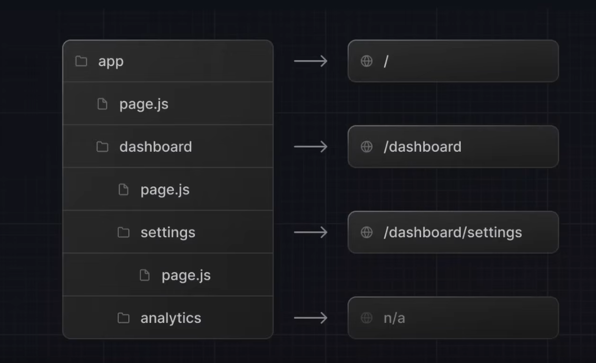
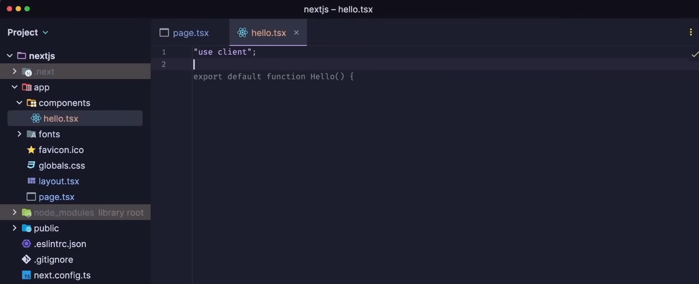
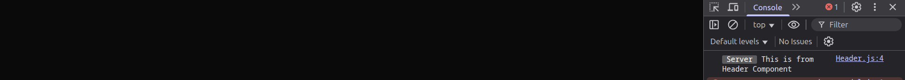
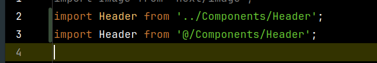

# Next.js

### Routing in Next Js

### Init Next Project

> Run ``` npx create-next-app@latest ```

> In React you need to install additional react-router package to create routes but next.js is using another thing called ``` File Based Routes ``` this mean the next.js see the folders and the files name and creating routes depend on it




### Server Side Rendering - SSR

> By default the next.js is using SSR that run the components in the server then return the data of HTML and JS to the user directly of what he need but if you want to use the ``` CSR - Client Side Rendering ``` you can simply put ``` 'use  client' ``` at the top of the main page



> if i log in console throw the components that it's server side rendering it mustn't be logged but it logged and return at the top SERVER means that logging is coming from the server



> Note: I can import with two ways in the next project - The ``` @ ``` means the project folder.




## When to use Server Side Rendering OR Client Side Rendering ?

> There Are table in the next.js Docs clearifying when to choose SSR and CSR


### Routing


# 📖 Auth.js in Next.js (NextAuth v5)
## 🔑 مقدمة

### Auth.js (NextAuth)
> هي مكتبة لإدارة تسجيل الدخول والمصادقة في تطبيقات Next.js 13+. بتدعم مزودين زي GitHub, Google, Facebook … إلخ، وكمان بتشتغل مع credentials أو custom providers.

### الفكرة الأساسية:

> auth() → بتجيب الـ session من السيرفر.

> signIn / signOut → بتتعامل مع تسجيل الدخول والخروج من الكلاينت.

> useSession() → هوك في الكلاينت يجيبلك حالة المستخدم.


🆚 الفرق بين @/app/auth و next-auth/react
Feature	@/app/auth (Server)	next-auth/react (Client)
بيشتغل في	Server Components / Route Handlers	Client Components
أهم الدوال	auth(), signIn, signOut (نسخة سيرفر)	signIn, signOut, useSession
بيعتمد على	cookies(), headers()	API routes + fetch
استخدام شائع	التحقق من session في السيرفر	أزرار login/logout، Hooks للتفاعل مع المستخدم
⚡ أمثلة عملية
### 1️⃣ التحقق من الـ Session في Server Component

```

// app/NavBar.tsx (Server Component)
import { auth } from "@/app/auth";
import NavAuth from "./NavAuth";
import Link from "next/link";

export default async function NavBar() {
  const session = await auth(); // SSR: يتحقق من session

  return (
    <nav className="flex justify-between p-4 bg-white">
      <Link href="/">Home</Link>
      <NavAuth session={session} />
    </nav>
  );
}

```

### 2️⃣ أزرار تسجيل الدخول والخروج (Client Component)

```
// app/NavAuth.tsx (Client Component)
"use client";

import { signIn, signOut } from "next-auth/react";
import Link from "next/link";

export default function NavAuth({ session }: { session: any }) {
  if (session?.user) {
    return (
      <div className="flex gap-2 items-center">
        <Link href={`/user/${session.user.id}`}>
          <span>{session.user.name}</span>
        </Link>
        <button onClick={() => signOut()}>Sign Out</button>
      </div>
    );
  }

  return (
    <div className="flex gap-2 items-center">
      <span>Welcome</span>
      <button onClick={() => signIn("github")}>Sign In</button>
    </div>
  );
}

```

### 3️⃣ استخدام useSession في الكلاينت مباشرة

```

// app/UserInfo.tsx (Client Component)
"use client";

import { useSession } from "next-auth/react";

export default function UserInfo() {
  const { data: session, status } = useSession();

  if (status === "loading") return <p>Loading...</p>;
  if (!session) return <p>You are not logged in</p>;

  return <p>Hello, {session.user?.name} 👋</p>;
}

```
## 💡 Tips & Tricks

```

افصل بين Client و Server Components:

auth() في السيرفر فقط.

signIn/signOut في الكلاينت فقط.

لو محتاج session في كل الصفحات: اعمل wrapper (Server Component) يجيب الـ session ويبعته كـ prop.

Redirect بعد تسجيل الدخول:

signIn("github", { callbackUrl: "/dashboard" });

```

```

حماية Route في السيرفر:

const session = await auth();
if (!session) redirect("/login");


حماية Route في الكلاينت:
استعمل useSession() وتحقق من status === "authenticated".

ديباج: شغل NEXTAUTH_DEBUG=true في .env عشان تعرف تفاصيل أكتر.

```


## 🚀 الخلاصة

```

استعمل @/app/auth لما تكون في Server Component أو API Route.

استعمل next-auth/react لما تتعامل مع buttons, events, hooks في Client Components.

كده بتحصل على أفضل مزيج بين SSR و CSR من غير errors زي:

headers was called outside a request scope

```

### How to Compile Server Side Rendering - With -  Client Side Rendering

> We can simply using form -> the form in Next is sending and runs in the server <br>The Problem is when clicking on the buttons this action is consider as CSR and the action we want to made in the page is SSR here is the problem .<br>Simply we can make form and in it's action we define it's function as SSR and then make the function we want to made this will seperate the button that will live in the page as CSR and the form action is sent to server and runs their as SSR like the following code

```
'use client';

const Home = () => {
  ....

  <form action={async () => {
    'use server';

    await signIn('github'); // This will run in the server
  }}>
    <button type='submit'>
      Login
    </button>
  </form>
}

```

> But Best Practice is to make the button as component and make that component as SSR and the whole page as CSR like this : 


### NavAuth.tsx Page

```

'use client';

import Link from "next/link";
import {signIn, signOut} from "next-auth/react";
import Button from '@/app/components/ButtonOne';
import github from '@/public/github_icon.svg';
import logout from '@/public/signout_icon.svg';
import '@/app/components/NavBar.css';

export default function NavAuth ({session} : {session : any}){
    return (
        <div className='flex items-center gap-4'>
            {
                session && session.user ?
                    <>
                        <Link href={`/user/${session?.user?.id}`}>
                                    <span
                                        className='navbar-text'
                                    >
                                       <span className={'text-pink-700 text-[calc(100%+0.35rem)]'}> Welcome,</span> {session?.user?.name}
                                    </span>
                        </Link>
                        <Button
                            icon={logout}
                            text={'Sign Out'}
                            action={false}
                            />
                    </>
                    :
                    <>
                        <span
                            className='navbar-text'
                        >
                            Let<span className={'text-pink-700'}>'</span>s Sign <span className={'text-pink-700'}>In</span> !!!
                        </span>
                        <Button
                            icon={github}
                            text={'Sign In'}
                            action={true}
                            />
                    </>
            }
        </div>
    )
}

```

### ButtonOne.tsx Page


```

import Image from 'next/image';
import {signIn , signOut} from 'next-auth/react';

const ButtonOne = ({icon , text , action} : {icon: string , text: string , action: boolean }) => {
    return (
        <div
            className='w-fit h-fit
                flex flex-row gap-2 items-center justify-center
                border-t-2 border-l-2 border-r-4 border-b-4
                border-black rounded-md px-4 py-2 cursor-pointer
                transition duration-350 ease-in-out
                bg-white hover:bg-gray-100
            '
            onClick = {() => action ? signIn('github'): signOut() }
        >
            <Image
                src={icon}
                alt={`${text} image`}
                width={30}
                height={30}
                priority
                />
            <p className='inline text-black font-bold text-xl'>
                {text}
            </p>
        </div>
    )
}


export default ButtonOne;

```

## Debugging Next.js `searchParams` in Forms

### Problem Description
User tried to create a search bar form in Next.js App Router. The form updates the URL with `?query=...`, but the `query` prop passed to `HomeHeader` was always empty.

---

### Conversation

**Assistant:**  
Ahh okay ✅ now it’s clearer:  

- The URL **is updating correctly** → `/?query=hello`.  
- But `HomeHeader` still always gets `''` instead of `"hello"`.  

That means the problem is in how you’re typing/using `searchParams`.  

---

### 🚨 The issue
In your `HomeHeader` you did:

```tsx
const HomeHeader = ({searchParams}: {searchParams: {query?: string}}) => {
  const query = searchParams?.query || '';
  ...
}
```

But your `HomeHeader` is **not a page component** — it’s just a child inside `page.tsx`.  
👉 Only `page.tsx` (or a layout) gets the real `searchParams` from Next.js.  

So when you use `HomeHeader` directly, it doesn’t automatically receive `searchParams`. That’s why it’s always empty.

---

### ✅ Fix
Pass the searchParams down from your `page.tsx`:

**`app/page.tsx`**
```tsx
import HomeHeader from "./HomeHeader";

export default function Page({ searchParams }: { searchParams: { query?: string } }) {
  return <HomeHeader searchParams={searchParams} />;
}
```

**`app/HomeHeader.tsx`**
```tsx
import SearchBar from "@/app/components/SearchBar";
import YellowHeaderBar from "@/app/components/YellowHeaderBar";
import BlackHeaderBar from "@/app/components/BlackHeaderBar";
import bgImg from '@/public/bg.png';

const HomeHeader = ({ searchParams }: { searchParams: { query?: string } }) => {
  const query = searchParams?.query || '';

  return (
    <header
      className="w-full h-fit py-16 flex items-center justify-center flex-col bg-pink-600
                 max-sm:gap-4 sm:gap-4 md:gap-4 lg:gap-8"
      style={{ backgroundImage: `url("${bgImg.src}")` }}
    >
      <YellowHeaderBar text={'Pitch, Vote, and Grow'} />
      <BlackHeaderBar text={<p>Pitch Your Startup,<br/>Connect with Entrepreneurs</p>} />
      <p className="text-white font-medium text-center max-w-10/12 max-sm:text-sm sm:text-sm lg:text-2xl">
        Submit Ideas, Vote on Pitches, and Get Noticed in Virtual Competitions
      </p>
      <SearchBar query={query} />
    </header>
  );
};

export default HomeHeader;
```

---

### 🔑 Why this works
- Next.js only injects `searchParams` into **page** and **layout** components.  
- Child components (like `HomeHeader`) won’t magically get it — you must pass it down as props.  

---

**User:**  
this is work thank you but why the page is the one can take the params of the page and the HomeHeader is not ???

**Assistant:**  
Great 🎉 glad it’s working now!  

Here’s **why only `page.tsx` (and `layout.tsx`) get `searchParams` directly**, but not `HomeHeader`:  

---

### 🔑 How Next.js App Router works
- In the **App Router**, Next.js looks at files in the `app/` tree.  
- Certain special files get **automatic props from the framework**:
  - `page.tsx` → receives `{ params, searchParams }`
  - `layout.tsx` → receives `{ params, children }`
  - `error.tsx`, `loading.tsx`, `not-found.tsx` → also get special props  

So, when you write:

```tsx
export default function Page({ searchParams }) {
  return <HomeHeader searchParams={searchParams} />;
}
```

Next.js injects the `searchParams` only here because this file is the **entry point for the route** (`/`).  

---

### Why `HomeHeader` doesn’t get them automatically
`HomeHeader.tsx` is just a **regular React component**.  
From Next.js’ perspective it’s the same as if you created a `<Button>` or `<Card>`.  
It doesn’t know what props to give it, unless *you* pass them down.  

Think of it like this:  
- Next.js → “I’ll give the page component the query params for this URL.”  
- You → “Okay, I’ll forward them to my child components if they need them.”  

---

### 📝 Analogy
It’s like Express.js:
- The `req` object (with `req.query`) is only given to the **route handler**.
- If you call another function inside, you need to manually pass `req.query` down.  

---

⚡ So the rule is:  
- **Pages and layouts** get the automatic props.  
- **Child components** need you to pass them explicitly.  

---

**User:**  
is searchParams a keyword in the next refer to the search can be performed by form ?

**Assistant:**  
Nice question 👍  

No — `searchParams` is **not about forms directly**.  
It’s simply how **Next.js App Router** exposes the **query string** part of the URL.  

---

### Example
If the URL is:

```
/?query=hello&category=ai
```

Then in a **page.tsx** you can write:

```tsx
export default function Page({ searchParams }: { searchParams: { [key: string]: string | string[] | undefined } }) {
  console.log(searchParams);
  // { query: "hello", category: "ai" }
}
```

So `searchParams` is just an object that contains everything after the `?`.

---

### Relation to your form
Your form works like this:

```html
<form action="/" method="get">
  <input name="query" value="hello" />
  <button type="submit">Search</button>
</form>
```

- Submitting makes the browser go to `/ ?query=hello`  
- Next.js then gives `searchParams = { query: "hello" }` to your `page.tsx`.  
- From there, you can use it or pass it down to components like your `SearchBar`.

So:  
- The **form** just updates the URL query string.  
- Next.js picks up that query string and passes it to you as `searchParams`.  

---

👉 In short:  
- `searchParams` = Next.js keyword prop for query string params.  
- It’s not tied to `<form>`, but forms are the easiest way to add query params.


# 🔐 Protecting Routes in Next.js (App Router)

This guide explains how to protect pages in Next.js so users cannot access them unless signed in.

---

## 1. Using `layout.tsx` for Protected Sections

Best when protecting **multiple related routes** (e.g. `/dashboard/*`).

```tsx
// app/dashboard/layout.tsx
import { redirect } from "next/navigation"
import { getCurrentUser } from "@/lib/auth"  // your auth logic

export default async function DashboardLayout({
  children,
}: {
  children: React.ReactNode
}) {
  const user = await getCurrentUser()

  if (!user) {
    redirect("/login")  // 🚀 send them to login if not signed in
  }

  return <>{children}</>
}
```

👉 Every page in `/dashboard` will now require authentication.

---

## 2. Protecting a Single Page

Check authentication directly in the `page.tsx`.

```tsx
// app/profile/page.tsx
import { redirect } from "next/navigation"
import { getCurrentUser } from "@/lib/auth"

export default async function ProfilePage() {
  const user = await getCurrentUser()
  if (!user) redirect("/login")

  return <h1>Welcome {user.name}</h1>
}
```

---

## 3. Using Middleware for Early Blocking

Middleware runs before the page loads. Good for **strong security**.

```ts
// middleware.ts
import { NextResponse } from "next/server"
import type { NextRequest } from "next/server"

export function middleware(req: NextRequest) {
  const token = req.cookies.get("token")
  const isAuth = Boolean(token)

  if (!isAuth && req.nextUrl.pathname.startsWith("/dashboard")) {
    return NextResponse.redirect(new URL("/login", req.url))
  }
}
```

---

## ✅ Best Practice Summary

- **Many related pages** → Protect in `layout.tsx`  
- **Single page** → Check inside `page.tsx`  
- **Stronger security** → Use `middleware.ts`  
- **Production apps** often combine **middleware + layout checks** for double safety.

